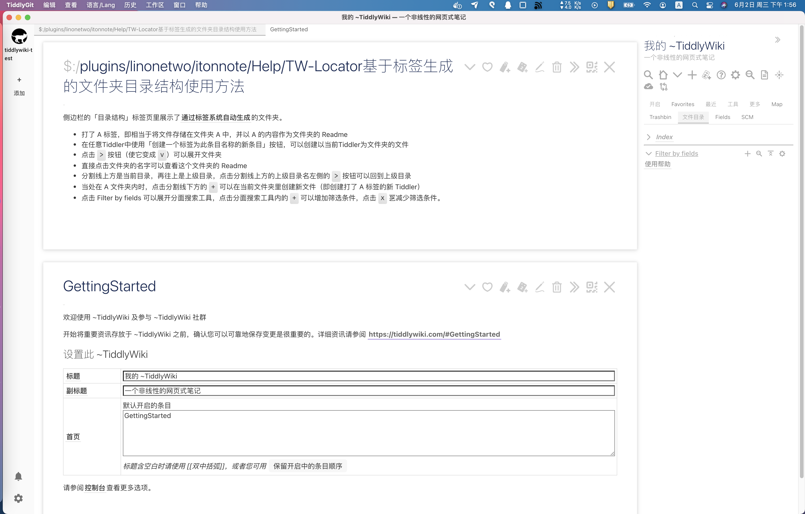
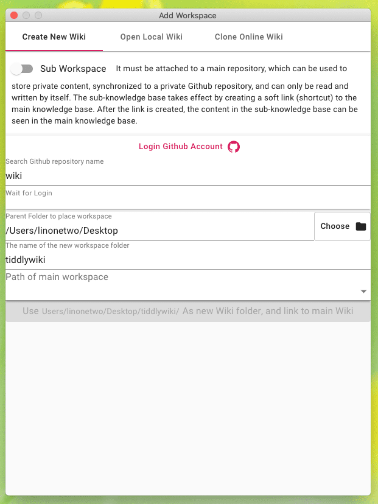
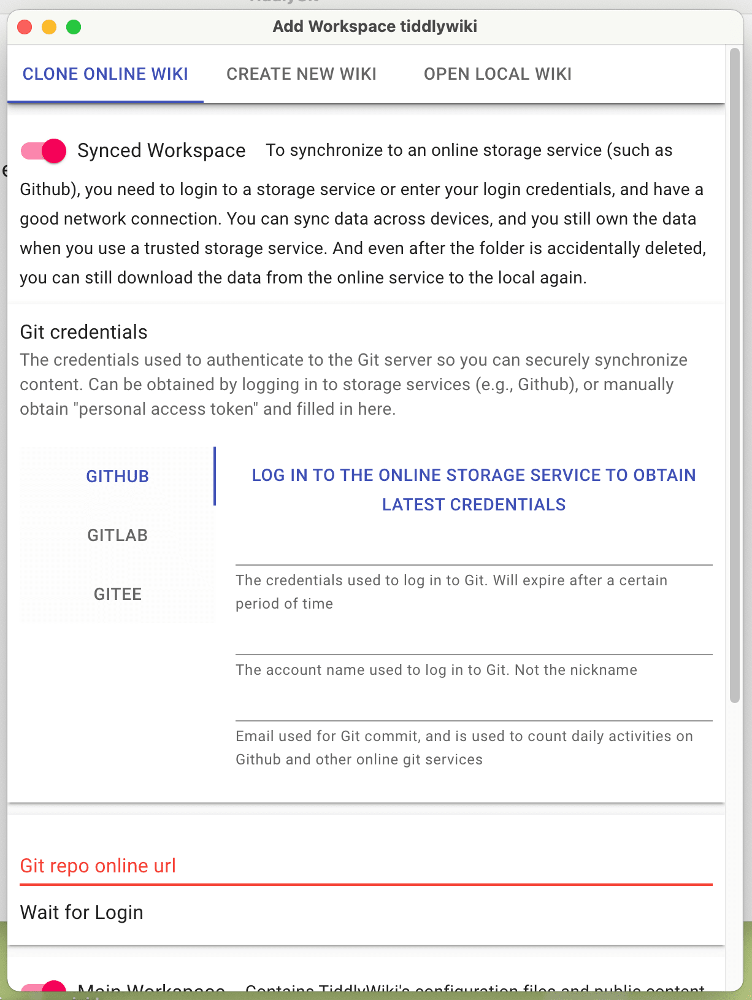
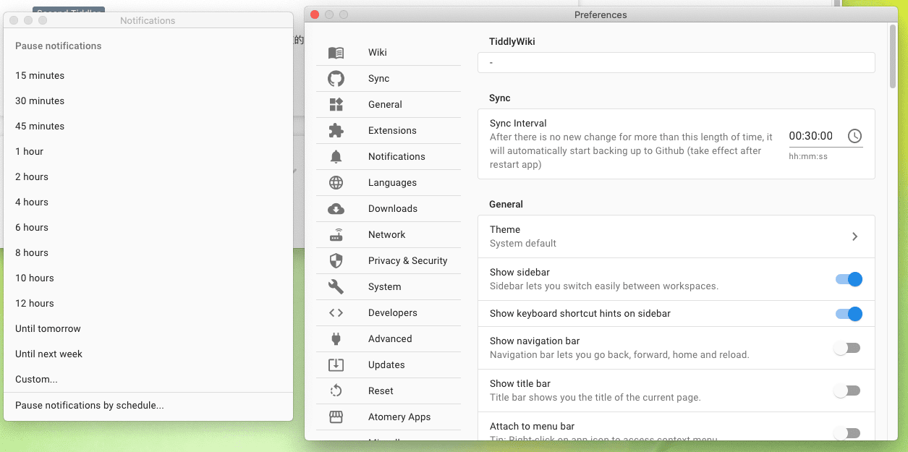

# TiddlyGit 太记 [](LICENSE)

| macOS                                                                                                                                                                                                   | Linux                                                                                                                                                                                                   | Windows                                                                                                                                                                                                       |
| ------------------------------------------------------------------------------------------------------------------------------------------------------------------------------------------------------- | ------------------------------------------------------------------------------------------------------------------------------------------------------------------------------------------------------- | ------------------------------------------------------------------------------------------------------------------------------------------------------------------------------------------------------------- |
| [](https://github.com/tiddly-gittly/TiddlyGit-Desktop/actions?query=workflow%3AmacOS) | [](https://github.com/tiddly-gittly/TiddlyGit-Desktop/actions?query=workflow%3ALinux) | [](https://github.com/tiddly-gittly/TiddlyGit-Desktop/actions?query=workflow%3AWindows) |

**TiddlyGit** - Customizable personal knowledge-base with git as backup manager and blogging platform.

**太记** - 可定制性极强的个人知识管理系统，使用 Git 作为备份管理器和博客平台。

---

You can choose storage provider for your wiki workspace:

1. "Github" as unlimited storage and gh-pages blogging platform.
1. "Local" will create a local git repo for you, you can use [GithubDesktop](https://github.com/desktop/desktop) to sync manually.
1. "Gitlab" and "Gitee" is on the way

---

你可以选择你的 WIKI 工作区的存储服务提供商：

1. 「Github」是一个无限存储空间、可以用 GH-Pages 部署博客的平台。
1. 「本地」模式会创建一个本地仓库来备份你的 WIKI，你可以用 [GithubDesktop](https://github.com/desktop/desktop) 来手动同步内容到云端。
1. 「Gitlab」和「码云」还待支持，不过架子已经搭好了。

---

|                                                                                                            [最新版下载按钮](https://github.com/tiddly-gittly/TiddlyGit-Desktop/releases/latest)                                                                                                            |
| :----------------------------------------------------------------------------------------------------------------------------------------------------------------------------------------------------------------------------------: |
| [](https://github.com/tiddly-gittly/TiddlyGit-Desktop/releases/latest) |

<details>
<summary>For mac users, since I haven't buy Apple developer key yet, so you have to entrust App to open it, click here to expand details.

Mac 使用者点击这里展开操作方法，我费劲办法也申请不到苹果开发者账号，所以你得手动信任这个应用 ◀</summary>

Click "Cancel" ↓


Click "Open" ↓


Click "OK" ↓


</details>

## About TiddlyGit-Desktop 关于「太记-桌面版」

---

TiddlyGit is a cross-platform Note Taking & GTD & Fragment Knowledge Management desktop app powered by [nodejs-TiddlyWiki](https://github.com/Jermolene/TiddlyWiki5#installing-tiddlywiki-on-nodejs), it ship with a lot of tiddlywiki plugins from the [TiddlyWiki community](https://groups.google.com/forum/#!forum/tiddlywiki).

You can call it TG-Note, it is totally free and you own all your data. Code by the people, build for the people.

---

「太记」是一个跨平台的笔记软件、时间和任务管理工具、碎片化知识管理工具，此乃其桌面版。「太记」基于强大的 [NodeJS 版「太微（TiddlyWiki）」](https://github.com/Jermolene/TiddlyWiki5#installing-tiddlywiki-on-nodejs) 构建，并带上了大量来自[太微社区（TiddlyWiki community）](https://groups.google.com/forum/#!forum/tiddlywiki)的插件。

「太记」来自 TiddlyWiki 的译名「太微」，以及 TiddlyGit 首字母的谐音。当然你也可以直接叫它 TGNote，镰锤 ☭ 笔记。

为什么把 TiddlyWiki 翻译成「太微」？因为受到 @pimgeek 的启发：TiddlyWiki 可以干很多细致轻量的工作，但也从不限制用法，可以无限组合叠加。故以其首字母音译为「太微」，TiddlyWiki 可以称为「太微笔记」「太微万能抽屉」「太微卡片盒」……

> 太微垣，三垣之一，按《步天歌》，太微垣為三垣的上垣。
> 太微垣又名天庭，是政府的意思，也是貴族及大臣們居住的地方。

---

### Screenshots 截图

|             Load NodeJS Wiki 加载 NodeJS 版维基             |
| :---------------------------------------------------------: |
|  |

|                 Create Local Wiki 新建本地维基                  |                   Clone Online Wiki 下载云端维基                    |
| :-------------------------------------------------------------: | :-----------------------------------------------------------------: |
|  |  |

|       Translation, Preferences 多语言翻译和设置界面       |
| :-------------------------------------------------------: |
|  |

### Differences from [TiddlyDesktop](https://github.com/Jermolene/TiddlyDesktop)? 与 [TiddlyDesktop](https://github.com/Jermolene/TiddlyDesktop) 的差别？

---

1. NodeJS version of TiddlyWiki have seamless auto-save experience, which is taking the advantage of SyncAdaptor instead of Saver, TG have better support for NodeJS wiki
1. Using NodeJS wiki, We can have separated tiddler files, which can be modified by hand, or by other programs (e.g. VSCode with [VSCode-TW5-Syntax](https://github.com/joshuafontany/VSCode-TW5-Syntax))
1. Though TiddlyDesktop can also load wiki folder generated by nodejs-TiddlyWiki, TG can backup that folder to the Github easily
1. With the Electron technology, we can use `fs`, `git` and many other nodejs things within TiddlyWiki, which greatly extend the hackability, which is the reason why I choose TiddlyWiki as my daily KM tool

---

1. 太微的 NodeJS 版本有无缝的自动保存体验，这是利用 SyncAdaptor 技术（而不是 Saver ）带来的的优势，太记对 NodeJS wiki 有更好的支持，而 TD 主要支持 HTML 版单文件 WIKI，各有优势。
1. 使用 NodeJS wiki 时，我们可以有分离的 tiddler 文件，这些文件可以手工修改，也可以由其他程序修改（例如装了 [VSCode-TW5-Syntax](https://github.com/joshuafontany/VSCode-TW5-Syntax) 的 VSCode)，而且方便细粒度备份回滚
1. 尽管 TiddlyDesktop 也可以加载由 nodejs 版太微生成的 wiki 文件夹，但太记还可以轻松地将该文件夹自动备份到 Github 上。
1. 通过使用 Electron 技术，我们可以在太微中使用 `fs` 、 `git` 和许多其他 nodejs 的扩展接口，这大大扩展了插件可使用的能力。这种可扩展性也是我选择太微作为我日常知识管理工具的原因，太记进一步强化了它。

---

### Why Github?

---

Because Github is one of the best free civil level [BaaS](https://www.alibabacloud.com/blog/backend-as-a-service-baas-for-efficient-software-development_519851):

1. Its storage is basically free, allow us to store unlimited images and PDF files, which can have permanent URIs for public download
1. It has GraphQL API that allow us programmatically update our wiki
1. It has free [CI](https://github.com/features/actions) to automatically deploy our TiddlyWiki blog
1. It provides unlimited repository, public and private, which enables us to store private content into our TiddlyWiki

---

因为 Github 是最好的免费民用级[存储即服务（BaaS）](https://www.alibabacloud.com/blog/backend-as-a-service-baas-for-efficient-software-development_519851)之一。

1. 它的存储基本上是免费的，允许我们存储无限的图像和 PDF 文件，这些文件可以有永久的 URI 供公众下载。
1. 它有 GraphQL API，允许我们以程序化的方式更新我们的 wiki。
1. 它有免费的[CI](https://github.com/features/actions)来自动部署我们的太微博客。
1. 它提供了无限数量的代码仓库，分为公共的和私有的，这使我们能够将私有内容存储到我们的太微中仅在本地查看，然后只把公开部分部署成博客。

---

### Download

Just download it from Github Release [Free Download](https://github.com/tiddly-gittly/TiddlyGit-Desktop/releases/latest)

You can also find changelog in the Release.

## Development

Development plan of TiddlyGit-Desktop is listed in these [Kanban](https://github.com/tiddly-gittly/TiddlyGit-Desktop/projects).

Explanation of our code can be found in the [Wiki](https://github.com/tiddly-gittly/TiddlyGit-Desktop/wiki).

<details>
<summary>To contribute, fork this repo, then clone it and setup development environment</summary>
 
```shell
# First, clone the project:
git clone https://github.com/YOUR_ACCOUNT/TiddlyGit-Desktop.git
cd TiddlyGit-Desktop
# Or maybe you are just using Github Desktop
# or GitKraken to clone this repo,
# and open it in your favorite code editor and terminal app

# switch to the nodejs version same as electron used version, other wise you may get

# Error: The module '/Users/linonetwo/Desktop/repo/TiddlyGit-Desktop/node_modules/opencv4nodejs-prebuilt/build/Release/opencv4nodejs.node'

# was compiled against a different Node.js version using

# NODE_MODULE_VERSION 88. This version of Node.js requires

# NODE_MODULE_VERSION 93. Please try re-compiling or re-installing

# the module (for instance, using `npm rebuild` or `npm install`).

# See https://github.com/justadudewhohacks/opencv4nodejs/issues/401#issuecomment-463434713 if you still have problem rebuild opencv for @nut-tree/nut-js

nvm use

# install the dependencies

npm i

# Run development mode

# You can see webpack error messages in http://localhost:9000/

npm start

# Build for production

npm run package

```

### Publish

Add a tag like `vx.x.x` to a commit, and push it to the origin, Github will start building App for all three platforms.

After Github Action completed, you can open Releases to see the Draft release created by Github, add some comment and publish it.

</details>

## Credits

The desktop app shell is based on [https://github.com/atomery/singlebox](atomery/singlebox) and [atomery/webcatalog](https://github.com/atomery/webcatalog), they provide lots of utils around website-generated-app, much powerful than generating app from website simply using Chrome. Also the independent developer @quanglam2807 behind these great tools helps me a lot when I develop TiddlyGit.

Current Icon is download from [iconsdb](https://www.iconsdb.com/custom-color/github-11-icon.html) under Creative Commons Attribution-NoDerivs 3.0 , if you are a designer, please feel free to contribute your ICON if you have a better idea.
```
