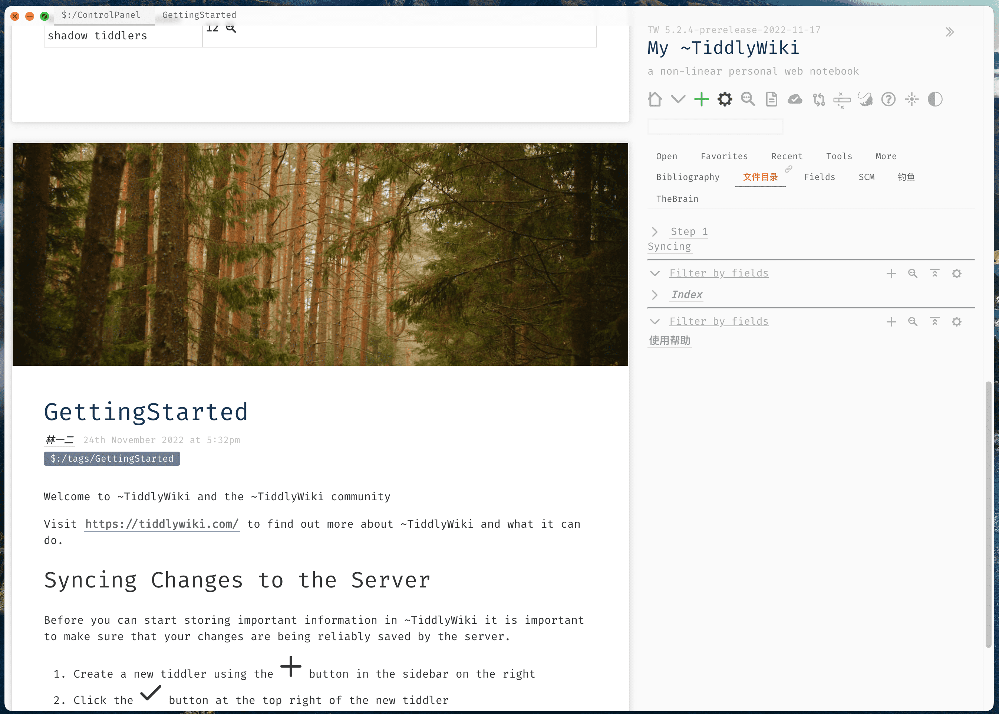
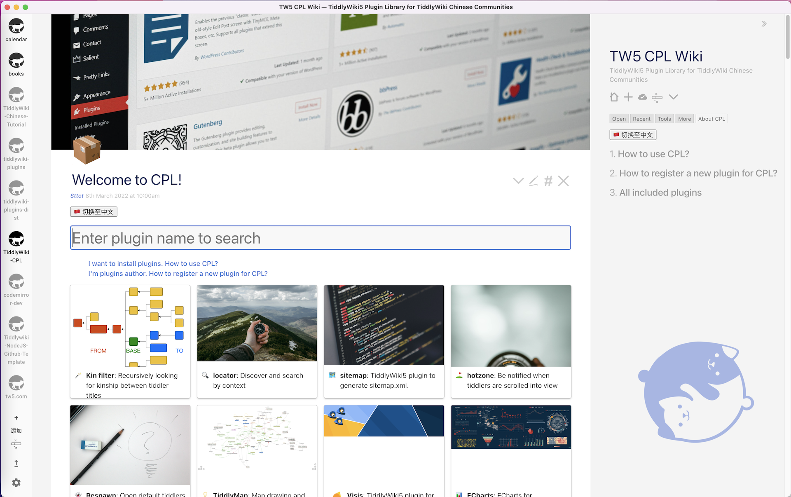

<div align="center">
<h1> TidGi </h1>
<p> Customizable personal knowledge-base with git as backup manager and blogging platform. </p>

[](LICENSE)
[](https://github.com/tiddly-gittly/TidGi-Desktop/actions)
[](https://github.com/linonetwo)

</div>

<hr>

# TOC

🇬🇧 English | <a href="https://github.com/tiddly-gittly/TidGi-Desktop/blob/master/docs/readme/README.zh-CN.md">🇨🇳 简体中文</a>

<!-- toc -->

- [ShowCases And Demo](#showcases-and-demo)
- [Related Posts About TidGi](#related-posts-about-tidgi)
- [About TidGi-Desktop](#about-tidgi-desktop)
- [Download](#download)
- [Mobile App](#mobile-app)
- [Data Privacy Protection](#data-privacy-protection)
- [Differences](#differences)
- [Why Github?](#why-github)
- [Development](#development)
- [Credits](#credits)
  - [Stargazers over time](#stargazers-over-time)

<!-- tocstop -->

---

<div align="center">

[](https://github.com/tiddly-gittly/TidGi-Desktop/releases/latest)
  
More: [Download](#download)
</div>

## ShowCases And Demo

### Demo

- [Demo Online Web Blog Page](https://tiddly-gittly.github.io/Tiddlywiki-NodeJS-Github-Template/)
- [TiddlyWiki Official Website](https://tiddlywiki.com/)

### Screenshot



<details>

|                     Load NodeJS Wiki                     |
| :-------------------------------------------------------: |
|  |

|                       Create Local Wiki                       |                         Clone Online Wiki                         |
| :-----------------------------------------------------------: | :---------------------------------------------------------------: |
|  |  |

|                                                              Translation, Preferences                                                              |
| :------------------------------------------------------------------------------------------------------------------------------------------------: |
|                                                                                            |
|                                                                  Interactive code                                                                  |
|  |
|                                                              Community Plugin Library                                                              |
|                                                                            |

</details>

<details>
<summary>For mac users, since I haven't buy Apple developer key yet, so you have to entrust App to open it, click here to expand details.◀</summary>

First of all, you need to drag this App into Applications folder! Otherwise there will be an error.

Click "Cancel" ↓


Click "Open" ↓


Click "OK" ↓


</details>

## Related Posts About TidGi

No English posts yet...Please help sharing!

## About TidGi-Desktop

TidGi is a cross-platform Note Taking & GTD & Fragment Knowledge Management desktop app powered by [nodejs-TiddlyWiki](https://github.com/Jermolene/TiddlyWiki5#installing-tiddlywiki-on-nodejs), it ship with a lot of tiddlywiki plugins from the [TiddlyWiki community](https://groups.google.com/forum/#!forum/tiddlywiki).

You can call it [TG-Note](https://github.com/tiddly-gittly/TGNote), it is totally free and you own all your data. Code by the people, build for the people.

It used to named TiddlyGit, means TiddlyWiki with easy Git backup, short for TidGi now.

## Download

<a href="https://repology.org/project/tidgi/versions">
  
</a>

> For Windows MacOS normal user

|                                                                         [Download](https://github.com/tiddly-gittly/TidGi-Desktop/releases/latest)                                                                         |
| :---------------------------------------------------------------------------------------------------------------------------------------------------------------------------------------------------------------------: |
| [](https://github.com/tiddly-gittly/TidGi-Desktop/releases/latest) |

> For arch user

```bash
yay tidgi
```

> For MacOS CLI user

```bash
brew install TidGi # Not tested
```

## Mobile App

See [Tiddloid](https://github.com/donmor/Tiddloid) for Android App developed by donmor.

## Data Privacy Protection

You can choose storage provider for your wiki workspace:

1. "Github" as unlimited storage and gh-pages blogging platform.
2. "Local" will create a local git repo for you, you can use [GithubDesktop](https://github.com/desktop/desktop) to sync manually.
3. "Gitlab" and "Gitee" is on the way

## Differences

### Differences from [TiddlyDesktop](https://github.com/Jermolene/TiddlyDesktop)?

1. NodeJS version of TiddlyWiki have seamless auto-save experience, which is taking the advantage of SyncAdaptor instead of Saver, TG have better support for NodeJS wiki
2. Using NodeJS wiki, We can have separated tiddler files, which can be modified by hand, or by other programs (e.g. VSCode with [VSCode-TW5-Syntax](https://github.com/joshuafontany/VSCode-TW5-Syntax))
3. Though TiddlyDesktop can also load wiki folder generated by nodejs-TiddlyWiki, TG can backup that folder to the Github easily
4. With the Electron technology, we can use `fs`, `git` and many other nodejs things within TiddlyWiki, which greatly extend the hackability, which is the reason why I choose TiddlyWiki as my daily KM tool

## Why Github?

Because Github is one of the best free civil level [BaaS](https://www.alibabacloud.com/blog/backend-as-a-service-baas-for-efficient-software-development_519851):

1. Its storage is basically free, allow us to store unlimited images and PDF files, which can have permanent URIs for public download
2. It has GraphQL API that allow us programmatically update our wiki
3. It has free [CI](https://github.com/features/actions) to automatically deploy our TiddlyWiki blog
4. It provides unlimited repository, public and private, which enables us to store private content into our TiddlyWiki

## Development

Read [Dev doc](docs/Development.md) for details.

## Credits

The desktop app shell is based on [https://github.com/atomery/singlebox](atomery/singlebox) and [atomery/webcatalog](https://github.com/atomery/webcatalog), they provide lots of utils around website-generated-app, much powerful than generating app from website simply using Chrome. Also the independent developer @quanglam2807 behind these great tools helps me a lot when I develop TidGi.

Current Icon is download from [iconsdb](https://www.iconsdb.com/custom-color/github-11-icon.html) under Creative Commons Attribution-NoDerivs 3.0 , if you are a designer, please feel free to contribute your ICON if you have a better idea.

### Stargazers over time

Please give a star if you like it!

[](https://starchart.cc/tiddly-gittly/TidGi-Desktop)
