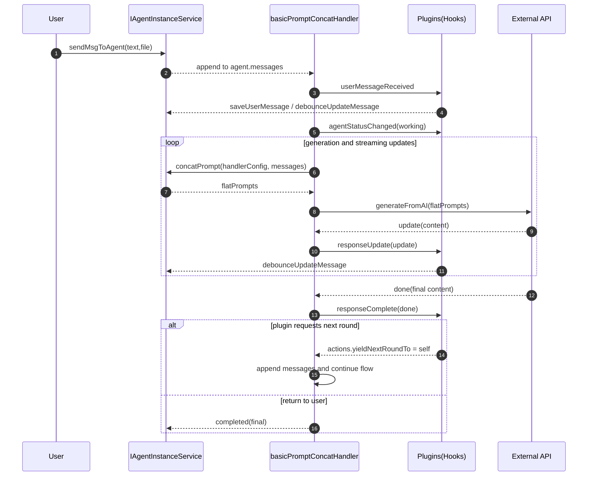
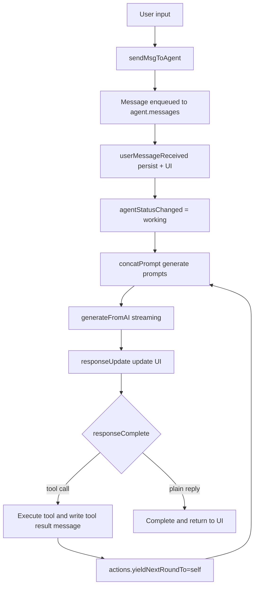

# AgentInstance and the plugin-based workflow

This document explains how an agentInstance invokes a handler and how logic is composed via plugins to enable strategy-like processing. It covers message persistence, streaming updates, tool calling, and second-round handoff.

## Overview

- Entry: `IAgentInstanceService.sendMsgToAgent` receives user input.
- Orchestrator: `basicPromptConcatHandler` drives prompt concatenation, AI calls, and plugin hooks.
- Plugins: `createHooksWithPlugins` attaches plugins to unified hooks with shared context, enabling decoupled, replaceable strategies.
- Data: message model `AgentInstanceMessage`, status model `AgentInstanceLatestStatus`.

### Handler selection and registration

- Source of handlerID: prefer the instance’s handlerID, fallback to the agent definition’s handlerID (see `src/pages/Agent/store/agentChatStore/actions/agentActions.ts#getHandlerId` and the preferences hook `useHandlerConfigManagement.ts`).
- Backend registration: in `AgentInstanceService.initialize()`, `registerBuiltinHandlers()` registers `basicPromptConcatHandler` under the ID `basicPromptConcatHandler`; `initializePluginSystem()` registers built-in plugins.
- Runtime selection: inside `sendMsgToAgent()`, the handler is fetched from `this.agentHandlers` by agentDef.handlerID and started as an async generator `const generator = handler(handlerContext)`, then iterated with `for await (const result of generator)`.

Related code:

- [index.ts](../../src/services/agentInstance/index.ts): `initialize()`, `registerBuiltinHandlers()`, `sendMsgToAgent()`
- [basicPromptConcatHandler.ts](../../src/services/agentInstance/buildInAgentHandlers/basicPromptConcatHandler.ts)

## Sequence

## Key design points

### 1. Event-driven strategy composition

– `createHooksWithPlugins` exposes unified hooks: `processPrompts`, `userMessageReceived`, `agentStatusChanged`, `responseUpdate`, `responseComplete`, `toolExecuted`.
– Plugins subscribe as needed and compose different strategies without changing the main flow.

Plugin registration and wiring:

- At app init, `initializePluginSystem()` registers built-in plugins to a global registry.
- For each round, `createHooksWithPlugins(handlerConfig)` creates a fresh hooks instance and attaches plugins per config.
- `responseConcat()` and `promptConcat` also look up `builtInPlugins` and run plugin logic (e.g., `postProcess`) with a dedicated context.

Stateless plugins requirement:

- Plugins must be stateless. Do not persist cross-round or cross-session state inside closures.
- All state must travel through `context` (e.g., `handlerContext.agent.messages`, `metadata`).
- Plugins may be registered to multiple hooks across conversations and then discarded; internal mutable state risks races and contamination.

### 2. Messages as the source of truth

– User, assistant, and tool result messages are all `AgentInstanceMessage`.
– `duration` limits how many subsequent rounds include a message in context.
– UI and persistence coordinate via `saveUserMessage` and `debounceUpdateMessage`.

Persistence and UI updates:

– User messages: `messageManagementPlugin.userMessageReceived` persists via `IAgentInstanceService.saveUserMessage`, pushes into `handlerContext.agent.messages`, and calls `debounceUpdateMessage` to notify UI.
– Streaming updates: `responseUpdate` maintains an in-progress assistant message (`metadata.isComplete=false`) with debounced UI updates.
– Finalization: `responseComplete` persists the final assistant message and updates UI once more.
– Tool results: `toolExecuted` persists messages with `metadata.isToolResult` and sets `metadata.isPersisted` to avoid duplicates.

### 3. Second-round handoff and control

– Plugins may set `actions.yieldNextRoundTo = 'self'` in `responseComplete` to trigger another LLM round immediately.
– The handler stops after reaching retry limits and returns the final result.

concatPrompt and prompt delivery:

– `AgentInstanceService.concatPrompt` exposes an observable stream for prompt assembly. The handler uses `getFinalPromptResult` to obtain final prompts before calling the external API.

## Example plugins

### messageManagementPlugin

Responsibilities:

– Persist user messages in `userMessageReceived` and sync UI.
– Manage streaming assistant message in `responseUpdate`; persist final content in `responseComplete`.
– Update status in `agentStatusChanged`.
– Persist tool results in `toolExecuted` and mark as persisted.

Notes:

– Update `handlerContext.agent.messages` in place for immediate UI rendering.
– Use debounced updates to reduce re-renders.
– Mark streaming messages with `metadata.isComplete`.

### wikiSearchPlugin

Responsibilities:

– Inject available wiki workspaces and tool list in `processPrompts`.
– On `responseComplete`, detect tool calls, execute, produce `isToolResult` message with `duration=1`.
– Set `actions.yieldNextRoundTo = 'self'` to continue immediately with tool outputs.

Notes:

– Validate parameters with zod.
– Use messages as the carrier for tool I/O.
– Set `duration=1` for tool-call assistant messages to economize context.

Tool calling details:

– Parse: detect tool-call patterns via `matchToolCalling` in `responseComplete`.
– Validate & execute: validate with zod, then `executeWikiSearchTool` uses workspace and wiki services to fetch results.
– History: create an `isToolResult` message (`role: 'user'`, `duration=1`) for the next round; report via `hooks.toolExecuted.promise(...)` so messageManagementPlugin persists and notifies UI.
– Loop: set `actions.yieldNextRoundTo='self'` to continue another round using tool outputs.

## Flow

## Related code

- [basicPromptConcatHandler.ts](../../src/services/agentInstance/buildInAgentHandlers/basicPromptConcatHandler.ts)
- [messageManagementPlugin.ts](../../src/services/agentInstance/plugins/messageManagementPlugin.ts)
- [wikiSearchPlugin.ts](../../src/services/agentInstance/plugins/wikiSearchPlugin.ts)
- [interface.ts](../../src/services/agentInstance/interface.ts)

## Benefits

– Loose coupling: the main flow stays unchanged while capabilities are pluggable.
– Testability: plugins can be unit-tested and integration-tested with the handler.
– Evolvability: new capabilities land as new plugins and hook subscriptions.

## Notes

– Avoid double persistence; use `metadata` flags for dedup.
– Ensure idempotency and robust error handling; prefer UI updates over persistence when degrading.
– Control retry limits and exit conditions to avoid infinite loops.
