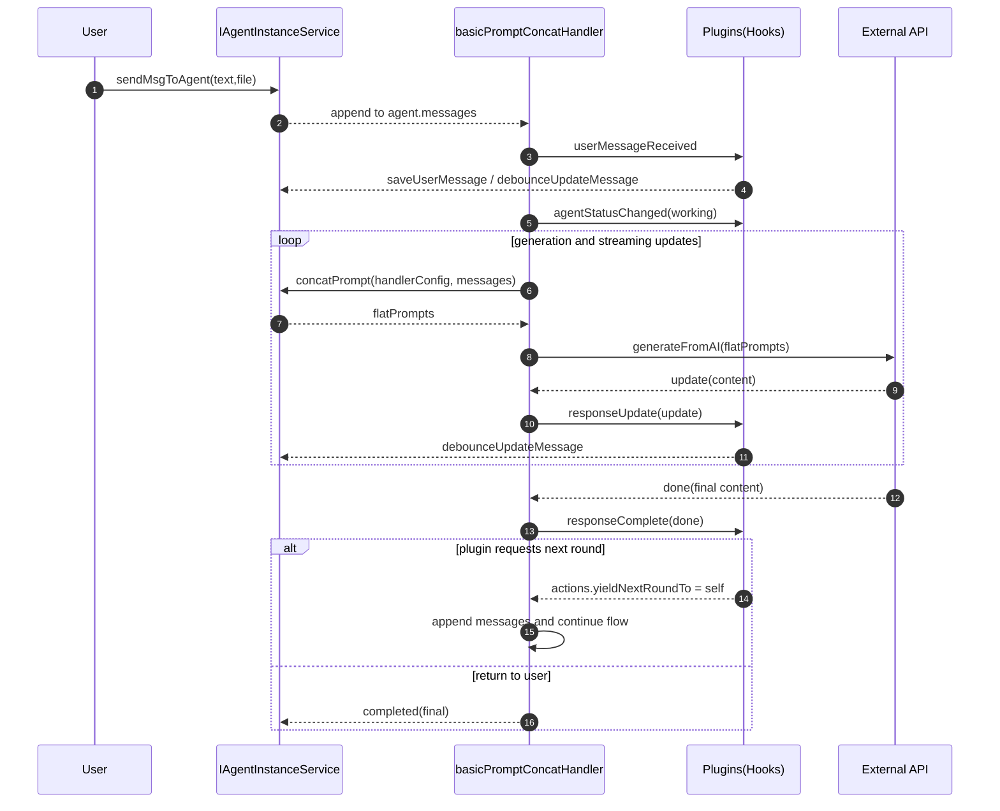
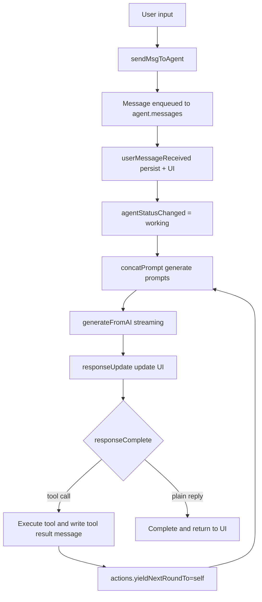

# AgentInstance and the plugin-based workflow

This document explains how an agentInstance invokes a handler and how logic is composed via plugins to enable strategy-like processing. It covers message persistence, streaming updates, tool calling, and second-round handoff.

## Overview

- Entry: `IAgentInstanceService.sendMsgToAgent` receives user input.
- Orchestrator: `basicPromptConcatHandler` drives prompt concatenation, AI calls, and plugin hooks.
- Plugins: `createHooksWithPlugins` attaches plugins to unified hooks with shared context, enabling decoupled, replaceable strategies.
- Data: message model `AgentInstanceMessage`, status model `AgentInstanceLatestStatus`.

### Handler selection and registration

- Source of handlerID: prefer the instance’s handlerID, fallback to the agent definition’s handlerID (see `src/pages/Agent/store/agentChatStore/actions/agentActions.ts#getHandlerId` and the preferences hook `useHandlerConfigManagement.ts`).
- Backend registration: in `AgentInstanceService.initialize()`, `registerBuiltinHandlers()` registers `basicPromptConcatHandler` under the ID `basicPromptConcatHandler`; `initializePluginSystem()` registers built-in plugins.
- Runtime selection: inside `sendMsgToAgent()`, the handler is fetched from `this.agentHandlers` by agentDef.handlerID and started as an async generator `const generator = handler(handlerContext)`, then iterated with `for await (const result of generator)`.

Related code:

- [index.ts](../../src/services/agentInstance/index.ts): `initialize()`, `registerBuiltinHandlers()`, `sendMsgToAgent()`
- [basicPromptConcatHandler.ts](../../src/services/agentInstance/buildInAgentHandlers/basicPromptConcatHandler.ts)

## Sequence

```mermaid
sequenceDiagram
  autonumber
  participant User as User
  participant AISvc as IAgentInstanceService
  participant Handler as basicPromptConcatHandler
  participant Hooks as Plugins(Hooks)
  participant API as External API

  User->>AISvc: sendMsgToAgent(text,file)
  AISvc-->>Handler: append to agent.messages
  Handler->>Hooks: userMessageReceived
  Hooks-->>AISvc: saveUserMessage / debounceUpdateMessage
  Handler->>Hooks: agentStatusChanged(working)
  loop generation and streaming updates
    Handler->>AISvc: concatPrompt(handlerConfig, messages)
    AISvc-->>Handler: flatPrompts
    Handler->>API: generateFromAI(flatPrompts)
    API-->>Handler: update(content)
    Handler->>Hooks: responseUpdate(update)
    Hooks-->>AISvc: debounceUpdateMessage
  end
  API-->>Handler: done(final content)
  Handler->>Hooks: responseComplete(done)
  alt plugin requests next round
    Hooks-->>Handler: actions.yieldNextRoundTo = self
    Handler->>Handler: append messages and continue flow
  else return to user
    Handler-->>AISvc: completed(final)
  end
```

## Key design points

### 1. Event-driven strategy composition

– `createHooksWithPlugins` exposes unified hooks: `processPrompts`, `userMessageReceived`, `agentStatusChanged`, `responseUpdate`, `responseComplete`, `toolExecuted`.
– Plugins subscribe as needed and compose different strategies without changing the main flow.

Plugin registration and wiring:

- At app init, `initializePluginSystem()` registers built-in plugins to a global registry.
- For each round, `createHooksWithPlugins(handlerConfig)` creates a fresh hooks instance and attaches plugins per config.
- `responseConcat()` and `promptConcat` also look up `builtInPlugins` and run plugin logic (e.g., `postProcess`) with a dedicated context.

Stateless plugins requirement:

- Plugins must be stateless. Do not persist cross-round or cross-session state inside closures.
- All state must travel through `context` (e.g., `handlerContext.agent.messages`, `metadata`).
- Plugins may be registered to multiple hooks across conversations and then discarded; internal mutable state risks races and contamination.

### 2. Messages as the source of truth

– User, assistant, and tool result messages are all `AgentInstanceMessage`.
– `duration` limits how many subsequent rounds include a message in context.
– UI and persistence coordinate via `saveUserMessage` and `debounceUpdateMessage`.

Persistence and UI updates:

– User messages: `messageManagementPlugin.userMessageReceived` persists via `IAgentInstanceService.saveUserMessage`, pushes into `handlerContext.agent.messages`, and calls `debounceUpdateMessage` to notify UI.
– Streaming updates: `responseUpdate` maintains an in-progress assistant message (`metadata.isComplete=false`) with debounced UI updates.
– Finalization: `responseComplete` persists the final assistant message and updates UI once more.
– Tool results: `toolExecuted` persists messages with `metadata.isToolResult` and sets `metadata.isPersisted` to avoid duplicates.

### 3. Second-round handoff and control

– Plugins may set `actions.yieldNextRoundTo = 'self'` in `responseComplete` to trigger another LLM round immediately.
– The handler stops after reaching retry limits and returns the final result.

concatPrompt and prompt delivery:

– `AgentInstanceService.concatPrompt` exposes an observable stream for prompt assembly. The handler uses `getFinalPromptResult` to obtain final prompts before calling the external API.

## Example plugins

### messageManagementPlugin

Responsibilities:

– Persist user messages in `userMessageReceived` and sync UI.
– Manage streaming assistant message in `responseUpdate`; persist final content in `responseComplete`.
– Update status in `agentStatusChanged`.
– Persist tool results in `toolExecuted` and mark as persisted.

Notes:

– Update `handlerContext.agent.messages` in place for immediate UI rendering.
– Use debounced updates to reduce re-renders.
– Mark streaming messages with `metadata.isComplete`.

### wikiSearchPlugin

Responsibilities:

– Inject available wiki workspaces and tool list in `processPrompts`.
– On `responseComplete`, detect tool calls, execute, produce `isToolResult` message with `duration=1`.
– Set `actions.yieldNextRoundTo = 'self'` to continue immediately with tool outputs.

Notes:

– Validate parameters with zod.
– Use messages as the carrier for tool I/O.
– Set `duration=1` for tool-call assistant messages to economize context.

Tool calling details:

– Parse: detect tool-call patterns via `matchToolCalling` in `responseComplete`.
– Validate & execute: validate with zod, then `executeWikiSearchTool` uses workspace and wiki services to fetch results.
– History: create an `isToolResult` message (`role: 'user'`, `duration=1`) for the next round; report via `hooks.toolExecuted.promise(...)` so messageManagementPlugin persists and notifies UI.
– Loop: set `actions.yieldNextRoundTo='self'` to continue another round using tool outputs.

## Flow

```mermaid
flowchart TD
  A[User input] --> B[sendMsgToAgent]
  B --> C[Message enqueued to agent.messages]
  C --> D[userMessageReceived persist + UI]
  D --> E[agentStatusChanged = working]
  E --> F[concatPrompt generate prompts]
  F --> G[generateFromAI streaming]
  G --> H[responseUpdate update UI]
  H --> I{responseComplete}
  I -->|tool call| J[Execute tool and write tool result message]
  J --> K[actions.yieldNextRoundTo=self]
  K --> F
  I -->|plain reply| L[Complete and return to UI]
```

## Related code

- [basicPromptConcatHandler.ts](../../src/services/agentInstance/buildInAgentHandlers/basicPromptConcatHandler.ts)
- [messageManagementPlugin.ts](../../src/services/agentInstance/plugins/messageManagementPlugin.ts)
- [wikiSearchPlugin.ts](../../src/services/agentInstance/plugins/wikiSearchPlugin.ts)
- [interface.ts](../../src/services/agentInstance/interface.ts)

## New architecture additions (2025-02)

### Iterative while-loop (replacing recursion)

The handler uses a `while` loop instead of recursive generator calls. This prevents stack overflow for long agentic loops and makes the control flow easier to follow.

### Parallel tool execution

When the LLM wraps multiple `<tool_use>` calls inside `<parallel_tool_calls>`, the framework executes them concurrently using a custom `executeToolCallsParallel()` utility:

- Does NOT use `Promise.all` (which would reject on first failure).
- Each tool gets its own timeout (configurable per-tool or using the global default).
- Results are collected for all tools (success, failure, and timeout), similar to `Promise.allSettled`.

Related code:

- [parallelExecution.ts](../../src/services/agentInstance/tools/parallelExecution.ts)
- [matchAllToolCallings](../../src/services/agentDefinition/responsePatternUtility.ts)

### Tool approval mechanism

Tools can be configured with approval rules:

- **auto**: execute immediately without user confirmation
- **confirm**: pause and show an inline approval UI; the user must allow or deny
- **Regex patterns**: `allowPatterns` auto-approve matching calls, `denyPatterns` auto-deny
- Evaluation order: denyPatterns → allowPatterns → mode

Settings are configurable via the "Tool Approval & Timeout Settings" modal in Preferences → AI Agent.

Related code:

- [approval.ts](../../src/services/agentInstance/tools/approval.ts)
- [ToolApprovalSettingsDialog.tsx](../../src/windows/Preferences/sections/ExternalAPI/components/ToolApprovalSettingsDialog.tsx)

### Sub-agent support

The `spawn-agent` tool creates child AgentInstance instances:

- Marked with `isSubAgent: true` and `parentAgentId` in the database
- Hidden from the default user-facing agent list
- Run independently with their own conversation and tools
- Return their final result to the parent agent as a tool result

### Token estimation and context window

- Approximate token counting via character heuristics (4 chars/token for Latin, 1 char/token for CJK)
- TokenBreakdown splits context into: system, tools, user, assistant, tool results
- Pie chart UI component shows usage ratio with warning/danger thresholds
- Future: API-based precise token counting

### API retry with exponential backoff

Uses the `exponential-backoff` npm package with:

- Configurable max attempts, initial delay, max delay, backoff multiplier
- Full jitter to prevent thundering herd
- Retryable error detection (429, 5xx, network errors)
- Retry-After header support

### MCP integration

Each agent instance creates its own MCP client connection(s):

- Supports both stdio and SSE transports
- Client connections are managed per-instance and cleaned up on agent close
- MCP tools are dynamically discovered and injected into the prompt

### New tools

| Tool ID              | Description                                           |
| -------------------- | ----------------------------------------------------- |
| `summary`            | Terminates agent loop with a final answer             |
| `alarm-clock`        | Schedules a future self-wake                          |
| `ask-question`       | Pauses to ask user a clarifying question with options |
| `wiki-backlinks`     | Find tiddlers linking to a given tiddler              |
| `wiki-toc`           | Get tag tree hierarchy                                |
| `wiki-recent`        | Recently modified tiddlers                            |
| `wiki-list-tiddlers` | Paginated tiddler list (skinny data)                  |
| `wiki-get-errors`    | Render tiddler and check for errors                   |
| `zx-script`          | Execute zx scripts in wiki context                    |
| `web-fetch`          | Fetch external web content                            |
| `spawn-agent`        | Delegate sub-task to a new agent instance             |

### Frontend improvements

- **Virtualization**: MessagesContainer uses `react-window` `VariableSizeList` for conversations with 50+ messages
- **Lazy loading**: Messages load by ID; content fetched from store only when rendered
- **React.memo**: MessageBubble wrapped with memo to reduce re-renders during streaming
- **WikitextMessageRenderer**: Renders wikitext via TiddlyWiki server with streaming opacity
- **AskQuestionRenderer**: Interactive inline UI for agent questions with clickable options
- **ToolApprovalRenderer**: Inline allow/deny buttons for tool approval requests

## Benefits

– Loose coupling: the main flow stays unchanged while capabilities are pluggable.
– Testability: plugins can be unit-tested and integration-tested with the handler.
– Evolvability: new capabilities land as new plugins and hook subscriptions.

## Notes

– Avoid double persistence; use `metadata` flags for dedup.
– Ensure idempotency and robust error handling; prefer UI updates over persistence when degrading.
– Control retry limits and exit conditions to avoid infinite loops.
