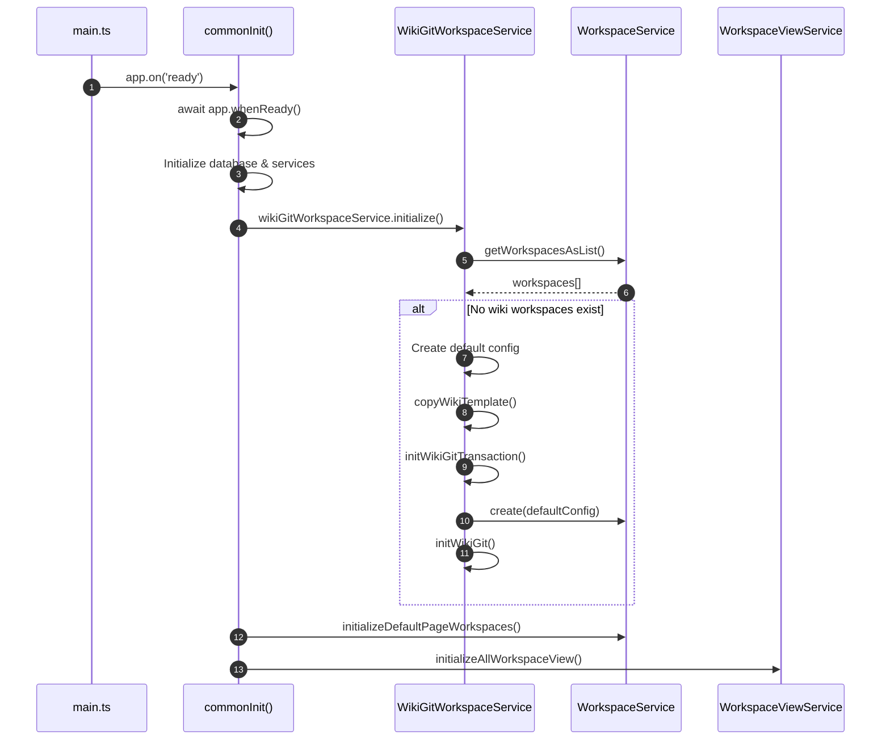
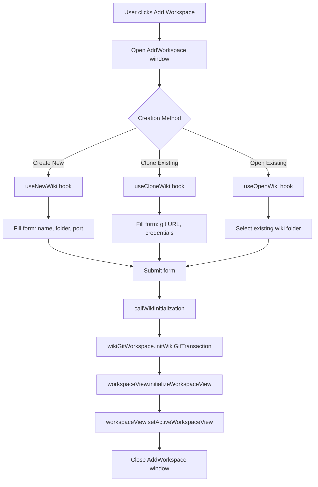

# Wiki Workspace Creation

## Overview

Wiki workspaces are the core concept in TidGi, representing individual TiddlyWiki instances with associated configuration, Git repositories, and UI views. This document explains how wiki workspaces are created in two scenarios:

1. **Automatic creation** when the application starts with no existing workspaces
2. **Manual creation** through the frontend UI

## Automatic Workspace Creation

### Startup Flow

When TidGi launches without any existing workspaces, it automatically creates a default wiki workspace. This logic is implemented in the initialization chain:



### Implementation Details

#### 1. Entry Point (main.ts)

The initialization starts in `src/main.ts` in the `commonInit()` function:

```typescript
const commonInit = async (): Promise<void> => {
  await app.whenReady();
  await initDevelopmentExtension();

  // Initialize database FIRST - all other services depend on it
  await databaseService.initializeForApp();

  // ... other initializations ...

  // Auto-create default wiki workspace if none exists
  await wikiGitWorkspaceService.initialize();
  
  // Create default page workspaces before initializing all workspace views
  await workspaceService.initializeDefaultPageWorkspaces();
  
  // Perform wiki startup and git sync for each workspace
  await workspaceViewService.initializeAllWorkspaceView();
};
```

#### 2. WikiGitWorkspaceService.initialize()

Located in `src/services/wikiGitWorkspace/index.ts`, this method checks if any wiki workspaces exist and creates a default one if needed:

```typescript
public async initialize(): Promise<void> {
  const workspaceService = container.get<IWorkspaceService>(serviceIdentifier.Workspace);
  const workspaces = await workspaceService.getWorkspacesAsList();
  const wikiWorkspaces = workspaces.filter(w => isWikiWorkspace(w) && !w.isSubWiki);
  
  // Exit if any wiki workspaces already exist
  if (wikiWorkspaces.length > 0) return;
  
  // Construct minimal default config with required fields
  const defaultConfig: INewWikiWorkspaceConfig = {
    order: 0,
    wikiFolderLocation: DEFAULT_FIRST_WIKI_PATH,
    storageService: SupportedStorageServices.local,
    name: 'wiki',
    port: 5212,
    isSubWiki: false,
    backupOnInterval: true,
    readOnlyMode: false,
    tokenAuth: false,
    tagName: null,
    mainWikiToLink: null,
    mainWikiID: null,
    excludedPlugins: [],
    enableHTTPAPI: false,
    lastNodeJSArgv: [],
    homeUrl: '',
    gitUrl: null,
  };
  
  try {
    // Copy the wiki template first
    const wikiService = container.get<IWikiService>(serviceIdentifier.Wiki);
    await wikiService.copyWikiTemplate(DEFAULT_FIRST_WIKI_FOLDER_PATH, 'wiki');
    
    // Create the workspace
    await this.initWikiGitTransaction(defaultConfig);
  } catch (error) {
    logger.error(error.message, error);
  }
}
```

#### 3. Wiki Template and Git Initialization

The `initWikiGitTransaction` method handles the complete workspace creation:

1. **Create workspace record**: Calls `workspaceService.create(newWorkspaceConfig)` to persist workspace configuration
2. **Copy wiki template**: Uses `wikiService.copyWikiTemplate()` to copy base TiddlyWiki files
3. **Initialize Git repository**: If not already initialized, calls `gitService.initWikiGit()`
4. **Rollback on failure**: If any step fails, removes the created workspace and wiki folder

```typescript
public initWikiGitTransaction = async (
  newWorkspaceConfig: INewWikiWorkspaceConfig, 
  userInfo?: IGitUserInfos
): Promise<IWorkspace | undefined> => {
  const workspaceService = container.get<IWorkspaceService>(serviceIdentifier.Workspace);
  const newWorkspace = await workspaceService.create(newWorkspaceConfig);
  
  try {
    // ... Git initialization logic ...
    
    if (await hasGit(wikiFolderLocation)) {
      logger.warn('Skip git init because it already has a git setup.');
    } else {
      const gitService = container.get<IGitService>(serviceIdentifier.Git);
      await gitService.initWikiGit(wikiFolderLocation, isSyncedWiki, !isSubWiki, gitUrl, userInfo);
    }
    
    return newWorkspace;
  } catch (error) {
    // Rollback: remove workspace and wiki folder
    await workspaceService.remove(workspaceID);
    await wikiService.removeWiki(wikiFolderLocation);
    throw new InitWikiGitError(error.message);
  }
};
```

#### 4. View Initialization

After workspace creation, `workspaceViewService.initializeAllWorkspaceView()` starts each wiki:

1. **Check wiki validity**: Verifies the wiki folder contains valid TiddlyWiki files
2. **Start wiki server**: Launches the TiddlyWiki Node.js server
3. **Create browser view**: Creates an Electron WebContentsView to display the wiki
4. **Load initial URL**: Navigates the view to the wiki's home URL

## Manual Workspace Creation

### User Interface Flow

Users can create new workspaces through the "Add Workspace" window:



### Frontend Components

#### 1. Form State Management (useForm.ts)

Located in `src/pages/AddWorkspace/useForm.ts`, manages workspace creation form state:

```typescript
export function useWikiWorkspaceForm(options?: { fromExisted: boolean }) {
  const [wikiFolderName, wikiFolderNameSetter] = useState('tiddlywiki');
  const [parentFolderLocation, parentFolderLocationSetter] = useState('');
  const [wikiPort, wikiPortSetter] = useState(5212);
  const [storageProvider, storageProviderSetter] = useState<SupportedStorageServices>(
    SupportedStorageServices.local
  );
  
  // Initialize default folder path
  useEffect(() => {
    (async function getDefaultExistedWikiFolderPathEffect() {
      const desktopPath = await window.service.context.get('DEFAULT_WIKI_FOLDER');
      parentFolderLocationSetter(desktopPath);
    })();
  }, []);
  
  // ... rest of form state ...
}
```

#### 2. Creation Hooks

Three main hooks handle different creation methods:

##### useNewWiki (useNewWiki.ts)

Creates a new wiki from template:

```typescript
export function useNewWiki(
  isCreateMainWorkspace: boolean,
  isCreateSub: boolean,
  form: IWikiWorkspaceForm,
  wikiCreationMessageSetter: (m: string) => void,
  // ...
): () => Promise<void> {
  const onSubmit = useCallback(async () => {
    wikiCreationMessageSetter(t('AddWorkspace.Processing'));
    
    try {
      const newWorkspaceConfig = workspaceConfigFromForm(form, isCreateMainWorkspace, true);
      
      // Create wiki folder and files
      if (isCreateMainWorkspace) {
        await window.service.wiki.copyWikiTemplate(
          form.parentFolderLocation, 
          form.wikiFolderName
        );
      } else {
        await window.service.wiki.copySubWikiTemplate(/* ... */);
      }
      
      // Initialize workspace and Git
      await callWikiInitialization(newWorkspaceConfig, wikiCreationMessageSetter, t, gitUserInfo, {
        from: WikiCreationMethod.Create
      });
    } catch (error) {
      wikiCreationMessageSetter(error.message);
      hasErrorSetter(true);
    }
  }, [/* dependencies */]);
  
  return onSubmit;
}
```

##### useCloneWiki (useCloneWiki.ts)

Clones an existing wiki from a Git repository:

```typescript
export function useCloneWiki(/* ... */): () => Promise<void> {
  const onSubmit = useCallback(async () => {
    wikiCreationMessageSetter(t('AddWorkspace.Processing'));
    
    try {
      const newWorkspaceConfig = workspaceConfigFromForm(form, isCreateMainWorkspace, true);
      
      // Clone from Git repository
      if (isCreateMainWorkspace) {
        await window.service.wiki.cloneWiki(
          form.parentFolderLocation,
          form.wikiFolderName,
          form.gitRepoUrl,
          form.gitUserInfo!
        );
      } else {
        await window.service.wiki.cloneSubWiki(/* ... */);
      }
      
      // Initialize workspace
      await callWikiInitialization(newWorkspaceConfig, wikiCreationMessageSetter, t, gitUserInfo, {
        from: WikiCreationMethod.Clone
      });
    } catch (error) {
      wikiCreationMessageSetter(error.message);
      hasErrorSetter(true);
    }
  }, [/* dependencies */]);
  
  return onSubmit;
}
```

##### useOpenWiki (useOpenWiki.ts)

Opens an existing wiki folder:

```typescript
export function useOpenWiki(/* ... */): () => Promise<void> {
  const onSubmit = useCallback(async () => {
    wikiCreationMessageSetter(t('AddWorkspace.Processing'));
    
    try {
      const newWorkspaceConfig = workspaceConfigFromForm(form, isCreateMainWorkspace, false);
      
      // No need to copy template or clone, wiki folder already exists
      // Just initialize workspace and start wiki
      await callWikiInitialization(newWorkspaceConfig, wikiCreationMessageSetter, t, gitUserInfo, {
        from: WikiCreationMethod.Open
      });
    } catch (error) {
      wikiCreationMessageSetter(error.message);
      hasErrorSetter(true);
    }
  }, [/* dependencies */]);
  
  return onSubmit;
}
```

#### 3. Common Initialization (callWikiInitialization)

Located in `src/pages/AddWorkspace/useCallWikiInitialization.ts`, this function performs the final workspace initialization steps:

```typescript
export async function callWikiInitialization(
  newWorkspaceConfig: INewWorkspaceConfig,
  wikiCreationMessageSetter: (m: string) => void,
  t: TFunction<'translation'>,
  gitUserInfo: IGitUserInfos | undefined,
  configs: ICallWikiInitConfig,
): Promise<void> {
  // Step 1: Initialize workspace and Git
  wikiCreationMessageSetter(t('Log.InitializeWikiGit'));
  const newWorkspace = await window.service.wikiGitWorkspace.initWikiGitTransaction(
    newWorkspaceConfig, 
    gitUserInfo
  );
  
  if (newWorkspace === undefined) {
    throw new Error('newWorkspace is undefined');
  }
  
  // Step 2: Initialize workspace view (starts wiki server, creates browser view)
  wikiCreationMessageSetter(t('Log.InitializeWorkspaceView'));
  await window.service.workspaceView.initializeWorkspaceView(newWorkspace, {
    isNew: true,
    from: configs.from
  });
  
  // Step 3: Activate the new workspace
  wikiCreationMessageSetter(t('Log.InitializeWorkspaceViewDone'));
  await window.service.workspaceView.setActiveWorkspaceView(newWorkspace.id);
  
  // Step 4: Close Add Workspace window (if not disabled)
  if (!configs.notClose) {
    await window.service.window.close(WindowNames.addWorkspace);
  }
}
```

## Workspace Creation Validation

### Wiki Folder Validation

The `checkWikiExist` method in WikiService validates that a folder contains a valid TiddlyWiki:

1. **Check folder exists**: Verifies the wiki folder path exists
2. **Check tiddlywiki.info**: For main wikis, requires `tiddlywiki.info` file
3. **Check plugin files**: Verifies required TiddlyWiki core files exist
4. **Show error dialog**: If validation fails and `showDialog: true`, prompts user to remove invalid workspace

The error message in the CI logs shows this validation:

```log
无法找到之前还在该处的工作区知识库文件夹！该目录不是一个知识库文件夹
```

This occurs when `initWikiGit` completes but wiki template files are not yet created, causing `initializeAllWorkspaceView` to fail validation.

## Related Code

### Backend Services

- [main.ts](../../src/main.ts): Application initialization entry point
- [wikiGitWorkspace/index.ts](../../src/services/wikiGitWorkspace/index.ts): `initialize()`, `initWikiGitTransaction()`
- [workspacesView/index.ts](../../src/services/workspacesView/index.ts): `initializeAllWorkspaceView()`, `initializeWorkspaceView()`
- [wiki/index.ts](../../src/services/wiki/index.ts): `copyWikiTemplate()`, `checkWikiExist()`
- [git/index.ts](../../src/services/git/index.ts): `initWikiGit()`

### Frontend UI Components

- [AddWorkspace/useForm.ts](../../src/pages/AddWorkspace/useForm.ts): Form state management
- [AddWorkspace/useNewWiki.ts](../../src/pages/AddWorkspace/useNewWiki.ts): Create new wiki
- [AddWorkspace/useCloneWiki.ts](../../src/pages/AddWorkspace/useCloneWiki.ts): Clone from Git
- [AddWorkspace/useOpenWiki.ts](../../src/pages/AddWorkspace/useOpenWiki.ts): Open existing wiki
- [AddWorkspace/useCallWikiInitialization.ts](../../src/pages/AddWorkspace/useCallWikiInitialization.ts): Common initialization logic

## Common Issues

### 1. Wiki Validation Failure

**Symptom**: Error message "该目录不是一个知识库文件夹" during initialization

**Cause**: Wiki template files not fully created before validation runs

**Solution**: Ensure `copyWikiTemplate()` completes before calling `initWikiGitTransaction()`

### 2. Git Initialization Timeout

**Symptom**: Workspace creation hangs during Git initialization

**Cause**: Git operations taking too long in CI or slow network conditions

**Solution**: Implement timeout protection in `initWikiGit()` or skip Git init for local-only wikis

### 3. Worker Not Starting

**Symptom**: Wiki operations timeout after workspace creation

**Cause**: Worker initialization fails if wiki folder validation fails

**Solution**: Ensure wiki folder passes validation before starting worker

## Best Practices

1. **Atomic Operations**: Use transactions (`initWikiGitTransaction`) to rollback on failure
2. **Validation First**: Always validate wiki folders before starting services
3. **Progress Feedback**: Use `wikiCreationMessageSetter` to show user progress
4. **Error Handling**: Catch and display user-friendly error messages
5. **Default Values**: Provide sensible defaults for optional configuration
6. **Cleanup on Failure**: Always remove partially created workspaces on error
