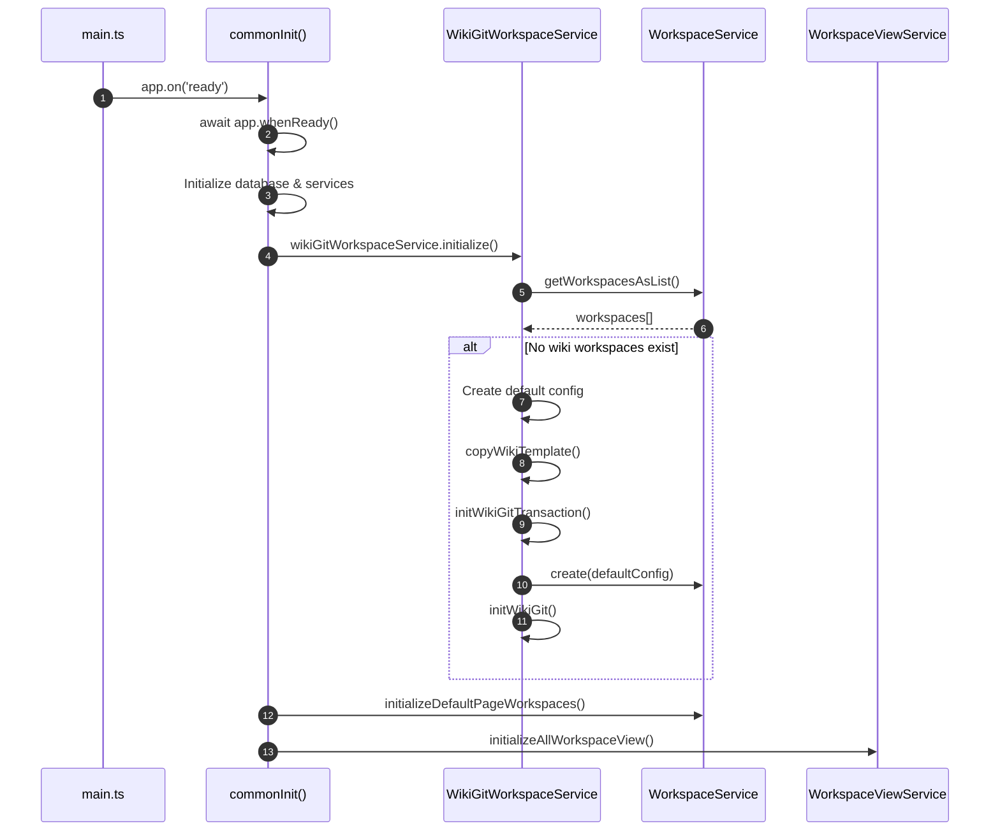
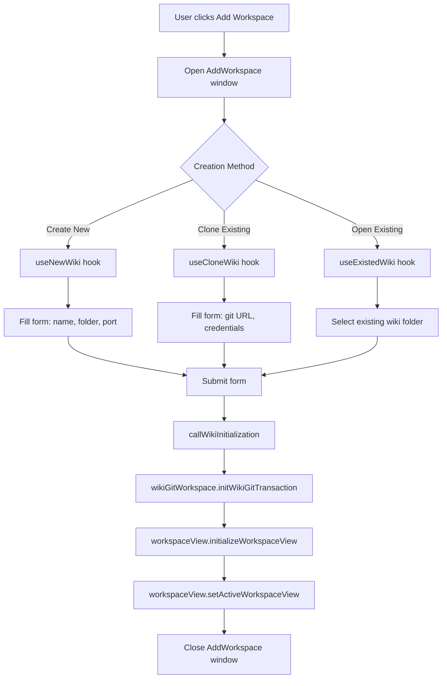

# Wiki Workspace Creation

## Overview

Wiki workspaces are the core concept in TidGi, representing individual TiddlyWiki instances with associated configuration, Git repositories, and UI views. This document explains how wiki workspaces are created in two scenarios:

1. Automatic creation when the application starts with no existing workspaces
2. Manual creation through the frontend UI

## Automatic Workspace Creation

### Startup Flow

When TidGi launches without any existing workspaces, it automatically creates a default wiki workspace. The initialization chain follows this sequence:

### Implementation Details

The initialization process involves several key steps:

1. Entry Point - The `commonInit()` function in [src/main.ts](../../src/main.ts) coordinates the startup sequence. It initializes the database, then calls `wikiGitWorkspaceService.initialize()` to handle automatic workspace creation.

2. Workspace Creation - The `initialize()` method in [src/services/wikiGitWorkspace/index.ts](../../src/services/wikiGitWorkspace/index.ts) checks if any wiki workspaces exist. If not, it creates a default workspace with basic configuration (name: 'wiki', port: 5212, local storage).

3. Template and Git Setup - The `initWikiGitTransaction()` method handles the complete creation process:
   - Creates workspace record via `workspaceService.create()`
   - Copies base TiddlyWiki files using `wikiService.copyWikiTemplate()`
   - Initializes Git repository with `gitService.initWikiGit()` if needed
   - Rolls back all changes if any step fails

4. View Initialization - After creation, `workspaceViewService.initializeAllWorkspaceView()` validates the wiki folder, starts the TiddlyWiki Node.js server, creates the browser view, and loads the initial URL.

## Manual Workspace Creation

### User Interface Flow

Users can create new workspaces through the "Add Workspace" window:

### Frontend Components

1. Form State Management - The `useWikiWorkspaceForm` hook in [src/windows/AddWorkspace/useForm.ts](../../src/windows/AddWorkspace/useForm.ts) manages the workspace creation form state, including folder name, location, port, and storage provider settings.

2. Creation Hooks - Three hooks handle different creation methods:

   - useNewWiki - Creates a new wiki from template. Located in [src/windows/AddWorkspace/useNewWiki.ts](../../src/windows/AddWorkspace/useNewWiki.ts), it copies the wiki template and initializes the workspace.

   - useCloneWiki - Clones an existing wiki from a Git repository. Located in [src/windows/AddWorkspace/useCloneWiki.ts](../../src/windows/AddWorkspace/useCloneWiki.ts), it handles Git cloning and workspace initialization.

   - useExistedWiki - Opens an existing wiki folder without copying or cloning. Located in [src/windows/AddWorkspace/useExistedWiki.ts](../../src/windows/AddWorkspace/useExistedWiki.ts), it validates the existing folder and initializes the workspace.

3. Common Initialization - The `callWikiInitialization` function in [src/windows/AddWorkspace/useCallWikiInitialization.ts](../../src/windows/AddWorkspace/useCallWikiInitialization.ts) performs the final steps: initializing workspace and Git, creating the workspace view, activating it, and closing the Add Workspace window.

## Workspace Creation Validation

The `checkWikiExist` method in WikiService validates that a folder contains a valid TiddlyWiki by checking folder existence, tiddlywiki.info file, and required plugin files. If validation fails, it can prompt the user to remove the invalid workspace.

The error "无法找到之前还在该处的工作区知识库文件夹！该目录不是一个知识库文件夹" occurs when `initWikiGit` completes but wiki template files are not yet created, causing `initializeAllWorkspaceView` to fail validation.

## Related Code

### Backend Services

- [main.ts](../../src/main.ts): Application initialization entry point
- [wikiGitWorkspace/index.ts](../../src/services/wikiGitWorkspace/index.ts): `initialize()`, `initWikiGitTransaction()`
- [workspacesView/index.ts](../../src/services/workspacesView/index.ts): `initializeAllWorkspaceView()`, `initializeWorkspaceView()`
- [wiki/index.ts](../../src/services/wiki/index.ts): `copyWikiTemplate()`, `checkWikiExist()`
- [git/index.ts](../../src/services/git/index.ts): `initWikiGit()`

### Frontend UI Components

- [AddWorkspace/useForm.ts](../../src/windows/AddWorkspace/useForm.ts): Form state management
- [AddWorkspace/useNewWiki.ts](../../src/windows/AddWorkspace/useNewWiki.ts): Create new wiki
- [AddWorkspace/useCloneWiki.ts](../../src/windows/AddWorkspace/useCloneWiki.ts): Clone from Git
- [AddWorkspace/useExistedWiki.ts](../../src/windows/AddWorkspace/useExistedWiki.ts): Open existing wiki
- [AddWorkspace/useCallWikiInitialization.ts](../../src/windows/AddWorkspace/useCallWikiInitialization.ts): Common initialization logic

## Common Issues

1. Wiki Validation Failure - Error "该目录不是一个知识库文件夹" appears when wiki template files are not fully created before validation runs. Ensure `copyWikiTemplate()` completes before calling `initWikiGitTransaction()`.

2. Git Initialization Timeout - Workspace creation may hang during Git initialization in CI or slow network conditions. Consider implementing timeout protection in `initWikiGit()` or skipping Git init for local-only wikis.

3. Worker Not Starting - Wiki operations timeout after workspace creation if worker initialization fails due to folder validation failure. Ensure wiki folder passes validation before starting worker.

## Best Practices

1. Use transactions (`initWikiGitTransaction`) to rollback on failure
2. Always validate wiki folders before starting services
3. Use `wikiCreationMessageSetter` to show user progress
4. Catch and display user-friendly error messages
5. Provide sensible defaults for optional configuration
6. Always remove partially created workspaces on error
