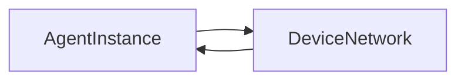
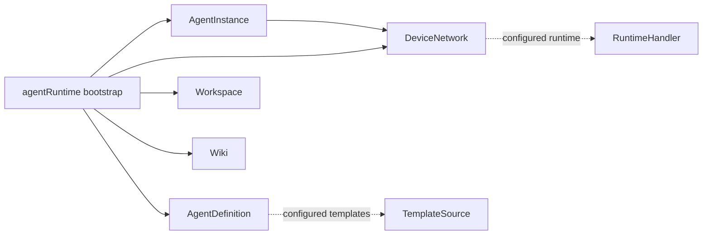

# Service Dependencies

This document records the current service dependency policy for the main-process Inversify container.

## Startup Rule

`src/services/libs/bindServiceAndProxy.ts` binds all services and immediately resolves every IPC-exposed singleton so `registerProxy` can publish the service descriptors. Any constructor or property injection that forms a cycle can therefore crash the app at startup.

Keep startup dependencies acyclic. If a lower-layer service wants to trigger higher-layer side effects, move that reaction into a bootstrap module or a higher-layer orchestrator instead of adding a reverse service dependency.

## Injection Policy

- Use direct `@inject` for lower-layer dependencies that are required during normal service operation and do not point back upward.
- Move wrong-layer side effects into `src/services/bootstrap/*` or another owning orchestration service. Examples: preference-change reactions, OAuth popup menu setup, and agent/device-network runtime wiring.
- Use Inversify `LazyServiceIdentifier` only when the dependency direction is correct and only the service identifier resolution must be deferred. Do not use it to hide a service-layer cycle.
- Do not add ad hoc `container.get()` inside services. `container.get()` is allowed in composition roots, tests, and narrow edge helper modules that are not themselves services.
- Keep `src/main.ts` light: resolve services and call named initializer/bootstrap functions. Put lifecycle wiring in bootstrap modules.

## Layers

### Layer 0: Foundation

- **Database**: stores settings and app databases.
- **Context**: app paths and version context.
- **Authentication**: depends on Database. OAuth popup context-menu setup is configured from bootstrap so Authentication does not depend on MenuService.

### Layer 1: Basic

- **Preference**: depends on Database. Preference side effects and reset confirmation are configured from bootstrap.
- **Analytics**: depends on Database and Preference.
- **ExternalAPI**: depends on Preference and Database.
- **AgentBrowser**: depends on Database.

### Layer 2: Agent Runtime

- **AgentDefinition**: depends on Database and AgentBrowser. Wiki template discovery is configured from bootstrap.
- **AgentInstance**: depends on Database, AgentDefinition, ExternalAPI, DeviceNetwork, Git, and Workspace.
- **DeviceNetwork**: depends on Authentication. Agent runtime RPC, sync storage, and capabilities are configured from bootstrap.

The former startup cycle was:

It is now split into a startup-safe edge plus runtime providers:

### Layer 3: UI Orchestration

- **Theme**: depends on Preference and Analytics. Wiki/view theme propagation is configured from bootstrap.
- **Updater**: depends on Context, Preference, Analytics, and MenuService.
- **NotificationService**: depends on Preference and View.
- **NativeService**: depends on Window and uses wiki/workspace operations at runtime.
- **View**, **Window**, **Workspace**, **WorkspaceView**, **Wiki**, **Sync**, **Git**, **WikiGitWorkspace**, and **MenuService** remain high-level orchestration services with many lifecycle interactions. New dependencies in these services should be checked against startup cycles before adding them.

### Layer 4: Specialized

- **WikiEmbedding**: depends on Database, ExternalAPI, Wiki, Workspace and initializes after core services.
- **DeepLink**, **GitServer**, **McpServer**, and tool modules are entrypoint/adapter-style surfaces. They may use the container at the edge, but service classes should still prefer direct injection or bootstrap configuration.

## Bootstrap Modules

- `bootstrap/agentRuntime.ts` initializes AgentDefinition and AgentInstance, then configures DeviceNetwork runtime RPC/storage/capabilities and AgentDefinition wiki template source.
- `bootstrap/preferenceReactions.ts` configures Preference side effects, reset confirmation, and Theme wiki/view propagation.
- Bootstrap modules may coordinate multiple services because they are composition-time wiring, not reusable domain services.

Before adding a bootstrap hook, first check whether the behavior belongs naturally in an existing higher-layer service. Use bootstrap when the behavior is lifecycle wiring across services rather than the responsibility of one service.
