buildInAgentHandlers

Built-in agent handlers that orchestrate AI conversation flows with advanced features like tool calling, multi-round processing, and response handling.

## Architecture

### System Overview

```mermaid
graph TD
    User[👤 Human User] --> Handler[🎯 basicPromptConcatHandler]
    Handler --> PS[🔌 Plugin System]
    Handler --> EAS[🌐 ExternalAPIService]
    Handler --> TE[🛠️ Tool Execution]
    
    PS --> PP[📝 Prompt Plugins]
    PS --> RP[🔄 Response Plugins]
    
    PP --> RAG[🔍 RAG Plugin]
    PP --> DP[📍 Dynamic Position]
    PP --> MCP[🤖 Model Context Protocol]
    
    RP --> TC[🔧 Tool Calling Plugin]
    RP --> AR[⚡ Auto Reply Plugin]
    
    TC --> |yieldNextRoundTo: 'self'| Handler
    AR --> |yieldNextRoundTo: 'self'| Handler
    RP --> |yieldNextRoundTo: 'human'| User
    
    EAS --> AI[🧠 AI Models]
    Handler --> |Tool detected| TE
    TE --> |Tool result| Handler
    
    style Handler fill:#e1f5fe
    style PS fill:#f3e5f5
    style EAS fill:#e8f5e8
    style TE fill:#fff3e0
```



### Control Flow Diagram

```mermaid
sequenceDiagram
    participant H as 👤 Human
    participant BC as 🎯 basicPromptConcatHandler
    participant PS as 🔌 Plugin System
    participant TCP as 🔧 Tool Calling Plugin
    participant EAS as 🌐 ExternalAPIService
    participant AI as 🧠 AI Model
    participant TE as 🛠️ Tool Executor
    
    H->>BC: User Message
    BC->>PS: Delegate Prompt Building
    PS->>PS: Run Prompt Plugins (RAG, MCP, etc.)
    PS->>BC: Enhanced Prompts
    
    BC->>EAS: Delegate AI Generation
    EAS->>AI: API Call
    AI->>EAS: Streaming Response
    EAS->>BC: AI Response
    
    BC->>PS: Delegate Response Processing
    PS->>TCP: Process AI Response
    TCP->>TCP: matchToolCalling(llmResponse)
    
    alt Tool Call Detected
        TCP->>BC: actions.yieldNextRoundTo='self' + toolCallInfo
        BC->>TE: executeTool(toolId, parameters)
        TE->>BC: Tool Result
        BC->>BC: Add Tool Result to Message History
        BC->>PS: Continue Round (loop back)
    else Auto Reply Triggered
        PS->>BC: yieldNextRoundTo='self' + newUserMessage
        BC->>PS: Continue Round (loop back)
    else Normal Completion
        PS->>BC: yieldNextRoundTo='human' (default)
        BC->>H: Final Response
    end
```



### Core Handler

basicPromptConcatHandler: Main conversation orchestrator that manages control flow between humans and AI models

- Control Flow Management: Handles transitions between human input and AI responses
- Delegation Model: Delegates specific work to specialized services and plugins
- Plugin Coordination: Orchestrates prompt processing and response handling plugins
- Service Integration: Integrates with external API services for AI communication

### Delegation Responsibilities

1. Prompt Concatenation → Delegated to Plugin System
   - Prompt plugins handle dynamic content injection and modifications
   - Retrieval augmented generation through plugins
   - Model context protocol integration

2. AI API Communication → Delegated to ExternalAPIService
   - Provider abstraction and configuration
   - Streaming response handling
   - Request cancellation and error handling

3. Response Processing → Delegated to Response Plugins
   - Tool calling detection and extraction
   - Auto-reply trigger evaluation
   - yieldNextRoundTo action determination

### Plugin System

promptConcat plugins: Pipeline for dynamic prompt and response processing

- Each plugin receives full context and can modify prompts/responses
- Response plugins can set `yieldNextRoundTo` actions to control conversation flow
- Tool calling detection and auto-reply behaviors are implemented as plugins
- Side effects allowed: Plugins can invoke tools and perform external operations
- Supports prompt injection, replacement, and conditional logic
- Chainable modifications with source path tracking

### Control Flow States

The handler manages transitions between different control states:

- Human Control: User input phase, waiting for human interaction
- AI Processing: AI model generating responses via ExternalAPIService
- Plugin Processing: Response plugins analyzing and modifying AI output
- Tool Execution: External tool calls triggered by AI responses
- Round Continuation: Automatic continuation based on plugin decisions

### YieldNextRoundTo Actions

Response plugins control conversation flow using `yieldNextRoundTo`:

- 'human' (default): Stop and wait for user input
- 'self': Continue with AI using current message history
- 'agent:agent-id': Yield to another agent (future feature)

Example plugin setting continuation:

```typescript
// In a response plugin
responseContext.actions = {
  yieldNextRoundTo: 'self', // Continue with AI
  newUserMessage: 'Execute the tool and continue'  // Optional custom message
};
```

## Handler Responsibilities

1. Control Flow Management
   - Coordinate transitions between human users and AI models
   - Process yieldNextRoundTo actions from response plugins
   - Manage retry logic and prevent infinite loops

2. Service Orchestration
   - Delegate prompt concatenation to plugin system
   - Delegate AI API calls to ExternalAPIService
   - Coordinate tool execution when detected

3. State Management
   - Maintain message history and conversation context
   - Track request IDs and cancellation state
   - Handle error states and recovery

## Flow

1. Receive user message and context
2. **Delegate** prompt building to plugin system
3. **Delegate** AI response generation to ExternalAPIService
4. **Delegate** response processing to response plugins
5. **Evaluate** yieldNextRoundTo actions from plugins
6. Execute tools if detected in responses
7. Continue or yield control based on plugin decisions

## New Plugin Architecture

### Unified Plugin System

All plugins are now centralized in `src/services/agentInstance/promptConcat/plugins/` with the following capabilities:

1. **PromptConcatPlugin**: Handles prompt processing and response processing
2. **HandlerPlugin**: Handles basicPromptConcatHandler hooks (toolExecuted, responseUpdate, responseComplete)
3. **UniversalPlugin**: Can register for both types of hooks

### Key Plugins

#### Tool Calling System
- **toolCallingResponsePlugin** (`toolCallingUnifiedPlugin.ts`): Detects tool calls in AI responses
- **toolExecutionHistoryPlugin** (`toolCallingUnifiedPlugin.ts`): Handles tool execution results and adds them to message history

#### Message Management
- **aiResponseHistoryPlugin** (`aiResponseHistoryPlugin.ts`): Manages AI response streaming and completion in message history
- **toolExecutionHistoryPlugin** (`toolCallingUnifiedPlugin.ts`): Handles tool execution results and adds them to message history

### Simplified sendMsgToAgent

The `sendMsgToAgent` method is now significantly simplified:
- Plugins handle all message history management via `debounceUpdateMessage`
- Only status updates and subscription notifications remain in the main method
- UI updates are handled directly by plugins using container-injected services
- No complex callback or persistence mechanisms needed

### Plugin-Based UI Updates

Plugins now directly update the UI using:
```typescript
const agentInstanceService = container.get<IAgentInstanceService>(serviceIdentifier.AgentInstance);
agentInstanceService.debounceUpdateMessage(message, agentId);
```

This provides a clean separation where:
- **UI Layer**: Only concerned with status updates and user interactions
- **Plugin Layer**: Handles all business logic, message management, and UI updates
- **Database Layer**: Automatically synchronized through existing debounce mechanisms

### Handler Hooks

The `basicPromptConcatHandler` now provides three hooks for plugins:

1. **toolExecuted**: Called when tool execution completes
2. **responseUpdate**: Called during AI response streaming
3. **responseComplete**: Called when AI response is complete

### Message History Management

Message history is now entirely managed by plugins:
- Tool execution results are added by `toolExecutionHistoryPlugin`
- AI responses are managed by `aiResponseHistoryPlugin`
- Custom plugins can control message visibility and insertion

This architecture provides much more flexibility and control, allowing plugins to influence multiple stages of the conversation flow while maintaining clear separation of concerns.
